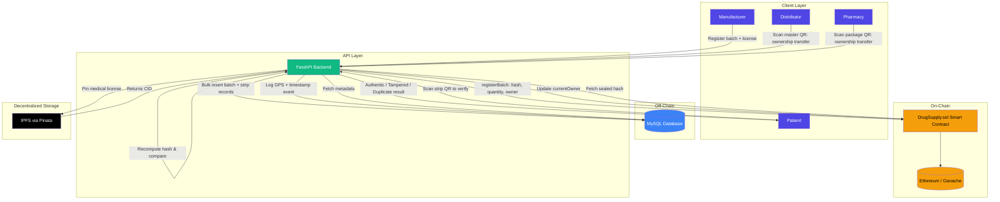
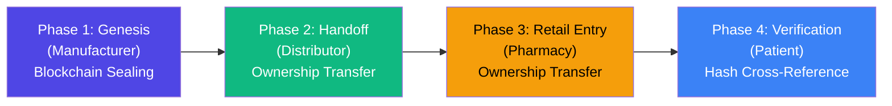
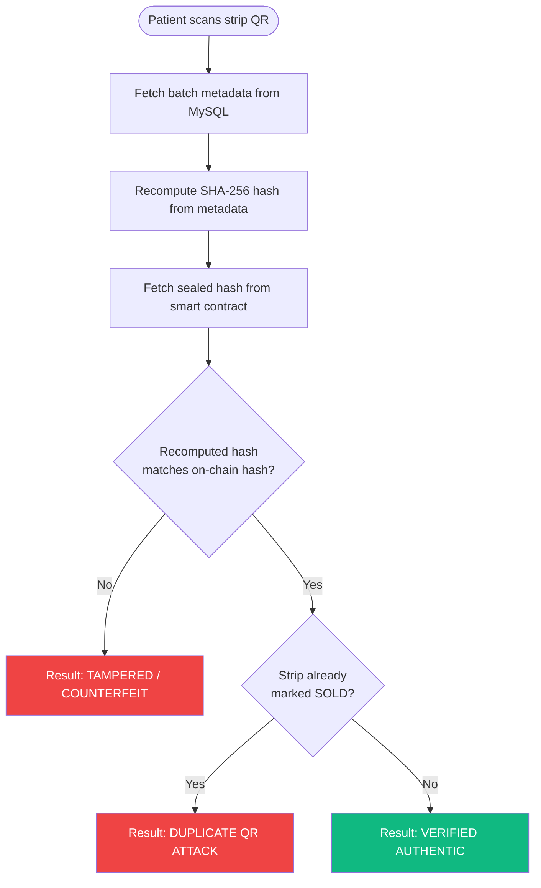

# Architecture

RxBlock uses a **Hybrid On-Chain / Off-Chain architecture**. The blockchain stores a cryptographic seal (SHA-256 hash) of each drug batch, acting as an immutable source of truth, while a relational database stores the rich, queryable metadata. A mismatch between the recomputed off-chain hash and the sealed on-chain hash is the system's tamper-detection mechanism.

## System Architecture

## Supply Chain Lifecycle

## Verification Logic

## Layer Summary

| Layer | Technology | Responsibility |
|---|---|---|
| On-Chain | Solidity / Ethereum (via Ganache locally) | Immutable batch ID, cryptographic hash, quantity, and current owner |
| Off-Chain | MySQL (via SQLAlchemy) | Drug metadata, per-strip status, GPS logs, ownership event history |
| Decentralized Storage | IPFS / Pinata | Manufacturer's medical license document, referenced by CID |
| API | FastAPI, Pydantic, Web3.py | Validates requests, coordinates on-chain writes and off-chain storage, performs verification |
